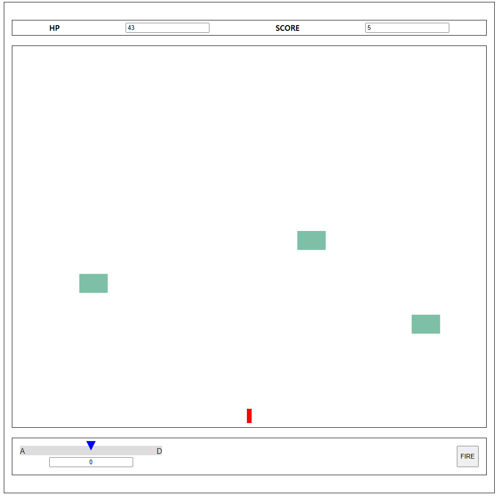

# 하늘에서 내려오는 적 맞추기 게임



## 실행 방법
1. frontend, server 폴더에 들어가서 각각 의존성을 설치한다.
2. 2개의 터미널을 연다.
3. 하나의 터미널에서 frontend 폴더에 들어간다.
4. ```npm run dev``` 을 터미널에 입력한다.
5. 두번째 터미널에서 server 폴더에 들어간다.
6. ```npm run start:dev``` 을 터미널에 입력한다.
7. http://localhost:5173 에 들어가면 게임이 시작된다.

## 조작법
|입력 | 동작|
|-|-|
|A|좌측으로 회전|
|D|우측으로 회전|
|FIRE 버튼 클릭|총알 발사|